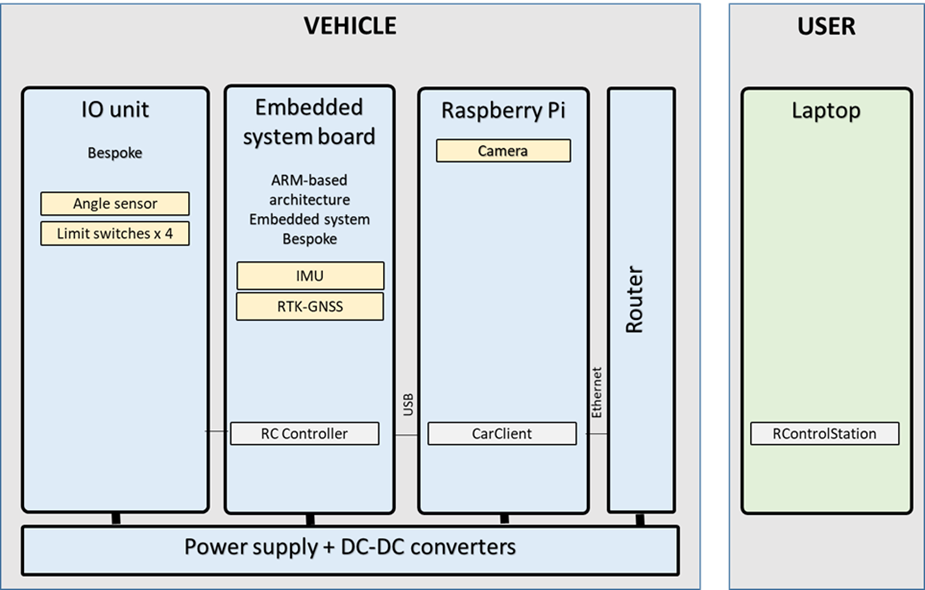

# RISE-SDVP at Macbot and Drängen 

This is a fork of https://github.com/vedderb/rise_sdvp (further developed as https://github.com/RISE-Dependable-Transport-Systems/ControlTower). Look there for documentation etc.

On this page you find information specific for its application on the Macbot and Drängen


## Hardware

The figure below shows a current hardware diagram of the implementation of the RISE-SDVP platform. The light blue-colored boxes to the left are the components on Macbot/Drängen and the green boxes to the right are a laptop computer connected over internet to the vehicle. The laptop computer also runs a RTK-GNSS base station, so that the model car can position itself with around 3 cm accuracy relative to the GNSS antenna connected to the receiver on the laptop.


Hardware components used:

- A [Controller](Hardware/Controller) that runs the embedded software that controls the motion and estimates the position of the model car.
- A [VESC](https://vesc-project.com) motor controller that controls the motor on the car over CAN-bus, and provides speed and position estimation from the motor that is used in the sensor fusion in the controller.
- A computer that runs the [RControlStation](Linux/RControlStation) software.
- An embedded Linux computer, in our case a [Raspberry PI](https://www.raspberrypi.org/) running [Car_Client](Linux/Car_Client) on that computer. It communicats with the [Controller PCB](Hardware/Controller) using an USB cabel and with [RControlStation](Linux/RControlStation) using any internet connection.

### Hardware components @ Macbot



### Hardware components @ Macbot

(to add - same as above, but without the IO unit)

## Steering Geometries

There is currently support for two different steering geometries: _Ackermann_ and _Differential_. In Ackermann steering mode there is one main motor driving the car, and a steering servo controlling the direction; whereas in differential mode there is one motor that drives the wheels on each side of the car and there is no steering servo. By default, the controller is configured for Ackermann steering, but that, and many other settings, can be changed in [conf_general.h](Embedded/RC_Controller/conf_general.h):

```
// Set to 1 to enable differential steering
#define HAS_DIFF_STEERING			1
// CAN ID of VESC motor controller for the left motor
#define DIFF_STEERING_VESC_LEFT		0
// CAN ID of VESC motor controller for the right motor
#define DIFF_STEERING_VESC_RIGHT	1
```

In addition to updating _conf_general.h_, geometry parameters for the car also have to be updated in RControlStation, as shown in Figure 3:


The most important parameters for Ackermann steering are listed in the following table. Some of them are not used in differential steering mode.

| Parameter      | Description             |
|--------------  |-----------------------------------------------------------------------------|
| Gear Ratio     | The ratio between one wheel revolution and one motor revolution.            |
| Turn Radius    | The radius of the circle the car follows at maximum steering angle.         |
| Wheel Diameter | Diameter of the model car wheels.                                           |
| Axis Distance  | Distance between front and rear wheel axis.                                 |
| Motor Poles    | Number of motor poles. Usually 2 or 4 for inrunners.                        |
| Servo Center   | PWM signal to output to steering servo when going straight [0 - 1].         |
| Servo Range    | Steering range. Negative numbers invert the servo direction [-1 - 1].       |

It is important to get these parameters correct, as they have a large impact on the position estimation and autopilot.

## Simulation Mode

It is possible to test the platform without having access to any other hardware than a computer. This can be done by running [Car_Client](Linux/Car_Client) with the following flags:

```
./Car_Client --usetcp --simulatecars 1:0
```

This will simulate a model car locally, including the autopilot. Then RControlStation can connecto to localhost over TCP and control the simulated car as if it were an actual model car. Car_Client accepts several different flags that affect the simulation; all flags can be listed using the -h argument:

```
./Car_Client -h
```

## Setting up a Raspberry Pi Image to run Car_Client

The login credentials on the image are:

```
User:     pi
Password: elpgem1
```

Starting by changing the password is a good idea.

Once the image is up and running, the repository should be updated to the latest version:

```
cd ~/rise_sdvp
git pull
```

At boot there is a screen session that starts automatically that runs Car_Client. Before rebuilding Car_Client, the screen session should be stopped with

```
killall screen
```

Then Car_Client should be rebuilt

```
cd ~/rise_sdvp/Linux/Car_Client
qmake -qt=5 DEFINES+=HAS_CAMERA
make clean
make
```
After that Car_Client can be started, and a connection can be made from RControlStation:

```
./Car_Client -p /dev/car --useudp --logusb --usetcp
```

Notice that there are udev rules that map the USB-serial device of the Controller to _/dev/car_

The next time the raspberry pi boots it will start a screen session with Car_Client. This is done from the ~/start_screen script. It might be a good idea to check if the Car_Client command in that script has the correct arguments for the latest version of rise_sdvp. At this time it should be

```
screen -d -m -S car bash -c 'cd /home/pi/rise_sdvp/Linux/Car_Client && ./Car_Client -p /dev/car --useudp --logusb --usetcp ; bash'
```

# Command flow

- **main.cpp** (function main) - Starts application (of class 'MainWindow') on laptop
- **MainWindow (hpp/cpp)** - Main Window class on the laptop. Some important aspects:
  - Inherits QT class 'QMainWindow'
  - Constructor initiates a large number of components, including some timers and [signals and slots](https://en.wikipedia.org/wiki/Signals_and_slots)
  - Contains connections to the vehicles via its member 'QList<CarInterface*> mCars'
  - Function 'timerSlot' loops continuously. It checks joystick values, if relevant send them to the vehicle, check vehicle status etc.
- **CarInterface (hpp/cpp)** - Some (high level) communication with the vehicle
  - setControlValues - sends steering information to the vehicle (via signal/slots setRcCurrent and setRcDuty)
  - setStateData - shows data received from the vehicle in the GUI
- **PacketInterface (hpp/cpp)** - (Low level) communication with the vehicle. For the format used see [information at the controller](Embedded/RC_Controller/README.md)  
  - sendPacket - send packet to vehicle
  - processPacket - processes packets received from the vehicle
  
